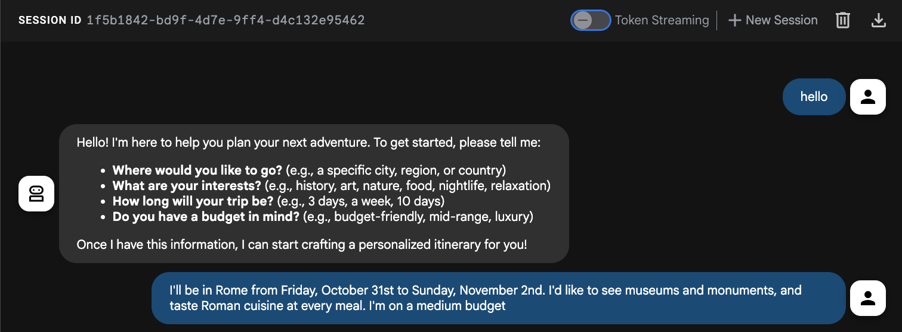
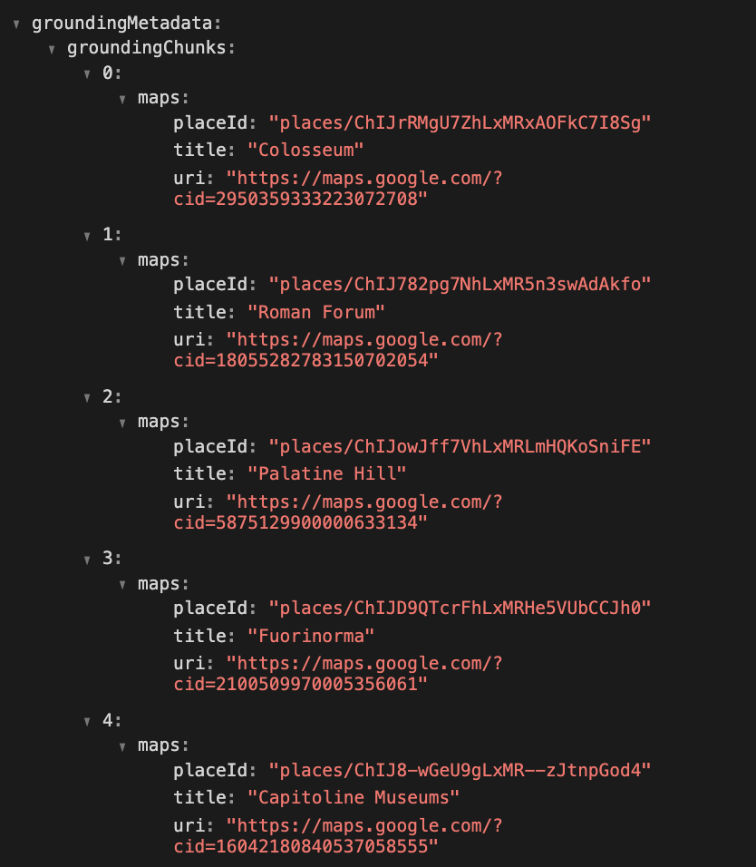
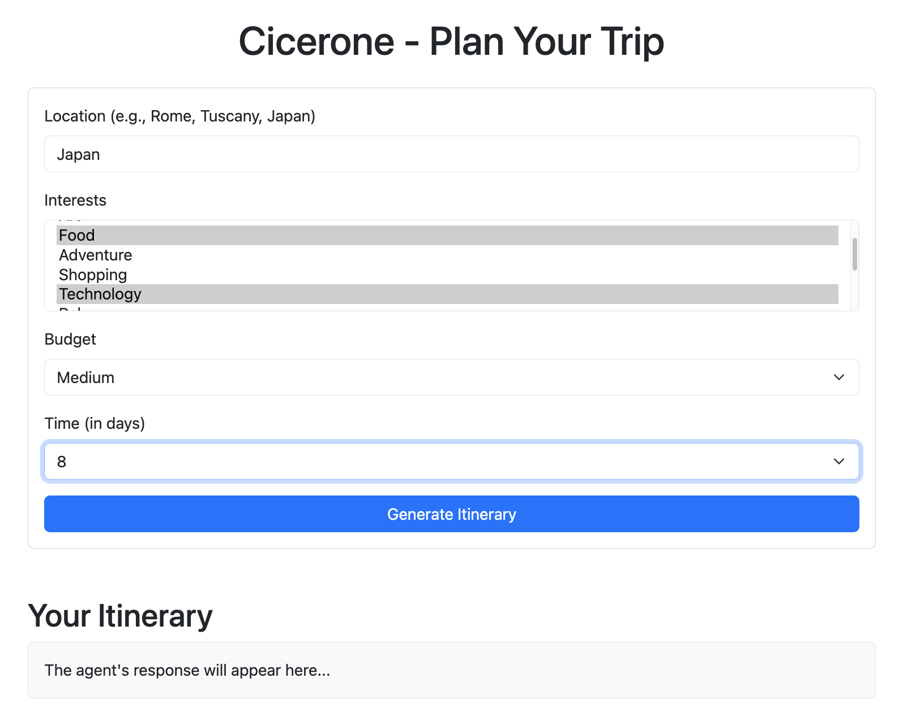

# Building a Personalized Travel Assistant with Google's ADK and the new Google Maps Grounding tool

This post describes the process of creating a tool to help users plan trips. The project uses the Google Agent Development Kit (ADK) to build a personalized travel assistant. A key aspect of this project is the integration of the `google_maps_grounding` tool, which allows the agent to access real-world geographical data from Google Maps. The result is Cicerone, an agent designed to create tailored itineraries for any location.


## Agent Implementation

The complete code for this project is available on [GitHub](https://github.com/ggalloro/cicerone).

The core of the application is a single travel planning agent named `Cicerone`, implemented using the `LlmAgent` class from the Google ADK.

The agent is designed to understand a user's travel needs—including the destination, interests, budget, and time—from a single prompt. It then uses its tools to find relevant attractions, restaurants, and plan a route.

The agent's prompt is written to be location-agnostic, allowing it to generate itineraries for any location specified by the user. Here is the code from `agent.py` that defines the agent:

```python
from google.adk.agents import Agent
from google.adk.tools import google_maps_grounding
import os

model = os.getenv("MODEL", "gemini-2.5-flash")

prompt="""You are a helpful travel assistant. Your goal is to create a complete, personalized itinerary for a given location (city, region, or country) based on the user's preferences.
- Understand the user's needs from their initial prompt: the location they want to visit, their interests, available time, and budget.
- Based on their interests, find suggestions for attractions and restaurants in the specified location using the google_maps_grounding tool.
- Choose only restaurants with a 4.5+ rating average.
- Organize the suggestions into a complete, optimized itinerary for the entire duration specified by the user.
- For each day, provide a schedule with the best route and travel times between locations, including detailed transportation advice (like bus numbers or metro lines).
- Present the final, complete itinerary in a clear, easy-to-read format. Do not ask for confirmation on each step; generate the full plan at once."""

root_agent=Agent(
    name="Cicerone",
    description="An agent for creating personalized tourist itineraries for any location (city, region, or country).",
    instruction=prompt,
    model=model,
    tools=[google_maps_grounding]
)
```

## The `google_maps_grounding` Tool

A significant challenge in building AI travel planners is ensuring the information is accurate and up-to-date. The `Cicerone` agent's ability to provide detailed and practical travel information is powered by the `google_maps_grounding` tool. This tool addresses the challenge by connecting the agent directly to Google Maps, allowing it to access a vast amount of real-world geographical data.

With this tool, the agent can:
- **Find Places:** Locate points of interest, such as museums, monuments, and restaurants, based on user queries.
- **Get Place Details:** Retrieve information about specific locations, including ratings and other relevant details.
- **Plan Routes:** Calculate travel times and get transportation suggestions between different points in the itinerary.

By grounding the agent's responses in structured data from Google Maps, the `google_maps_grounding` tool enables the creation of itineraries that are not only personalized but also practical and reliable.

The source code for the tool can be found in the [ADK Python repository on GitHub](https://github.com/google/adk-python/blob/main/src/google/adk/tools/google_maps_grounding_tool.py).


## Testing the Agent with ADK Web

The agent's core logic can be tested directly using the ADK Web UI, which provides a simple interface for interacting with agents.

To test the agent, run the following command from the project's root directory:
```bash
adk web
```
This will start the ADK Web UI. Select the `cicerone-agent` from the dropdown menu and introduce yourself or just say hello, the agent should ask information on the location you want to visit, your interests, budget and trip duration.



After you provided the needed information the agent should then generate a complete 3-day itinerary for Rome based on these preferences.


In the ADK Web UI you can also view, in the events, the google_maps_grounding tool response `groundingMetadata` field including `groundingChunks`: arrays of objects containing the maps sources (`uri`, `placeId` and `title`):



## Web Application Architecture

To provide a more user-friendly experience, I also built a simple a web application to serve the Cicerone agent.

The backend is a FastAPI web server that exposes the ADK agent. The frontend is a single-page application built with HTML, JavaScript, and Bootstrap. It features a form where users can input their travel preferences. This information is then sent to the agent, and the generated itinerary is displayed on the page. The application also includes a feature to save the generated itinerary as a text file.




## Conclusion

This project demonstrates how the Google Agent Development Kit can be used to build a single-agent application and expose it through a web interface. The integration of the `google_maps_grounding` tool is a key aspect, showing how grounding an agent with structured, real-world data can significantly enhance its capabilities. The use of a generalized prompt allows the agent to provide information for travel planning for any location, and the architecture can be extended with more features and tools as needed as, for example:
- Experimenting a multi-agent architecture (i wanted to focus on Google maps grounding in this example)
- User registration/autentication and profiles
- Possibility to save and modify itineraries


You can find the complete code for this project on [GitHub](https://github.com/ggalloro/cicerone), where you can clone it to test it and make your own improvements.
